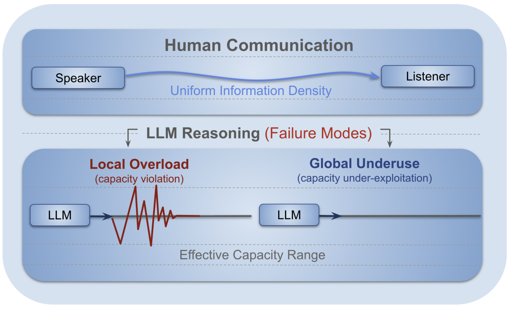

# Revisiting UID in LLM Reasoning

This repository contains code for analyzing the Uniform Information Density (UID) method for LLM reasoning. The accompanying paper, [Revisiting the Uniform Information Density Hypothesis in LLM Reasoning](https://aclanthology.org/2026.findings-acl.1565/), was accepted to Findings of ACL 2026.


## Method Overview

The UID hypothesis suggests that effective communication maintains a stable flow of information. In LLM reasoning, this project revisits that idea by measuring information density across generated reasoning traces.



The analysis focuses on two complementary UID signals:

- **Global UID:** `uid_variance_entropy`, measuring trajectory-level non-uniformity across the full reasoning path. The analysis compares outputs with the highest and lowest global UID.
- **Local UID:** `spikes_and_falls_3sigma`, measuring sharp local changes in stepwise entropy flow. The analysis compares outputs with the highest and lowest 3-sigma spike/fall counts.

Together, these metrics test whether strong reasoning traces are locally smooth while still using information non-uniformly at the global trajectory level.

## Running Inference

Use the scripts under `scripts/` to generate model outputs. For example:

```bash
cd scripts
bash inference.sh
```

The generated outputs are written under:

```text
scripts/outputs/runs.baselines/
```

## Running UID Analysis

After inference finishes, run:

```bash
cd scripts
bash analysis.sh
```

This scans completed inference outputs and writes analysis artifacts under:

```text
scripts/outputs/analysis_out/
```

The analysis outputs include:

- Global UID plots for `uid_variance_entropy`
- Local UID plots for `spikes_and_falls_3sigma`
- Combined global/local UID plots
- JSON summaries for UID accuracy and spike/fall accuracy
- Filtered overall metrics copied from each run's metrics file

## Citation

```bibtex
@inproceedings{gwak-etal-2026-revisiting,
    title = "Revisiting the {U}niform {I}nformation {D}ensity Hypothesis in {LLM} Reasoning",
    author = "Gwak, Minju and Son, Guijin and Kim, Jaehyung",
    booktitle = "Findings of the Association for Computational Linguistics: ACL 2026",
    year = "2026",
    address = "San Diego, California, United States",
    publisher = "Association for Computational Linguistics",
    url = "https://aclanthology.org/2026.findings-acl.1565/",
    pages = "31304--31333"
}
```
